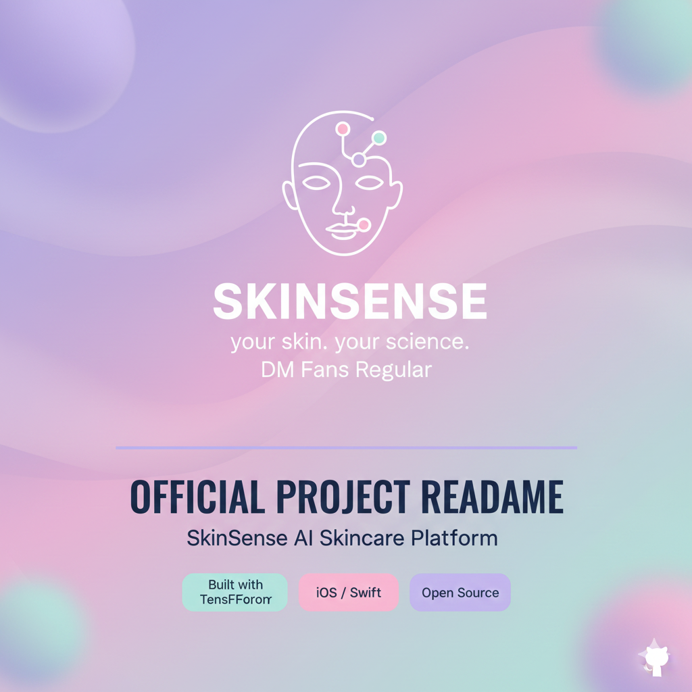
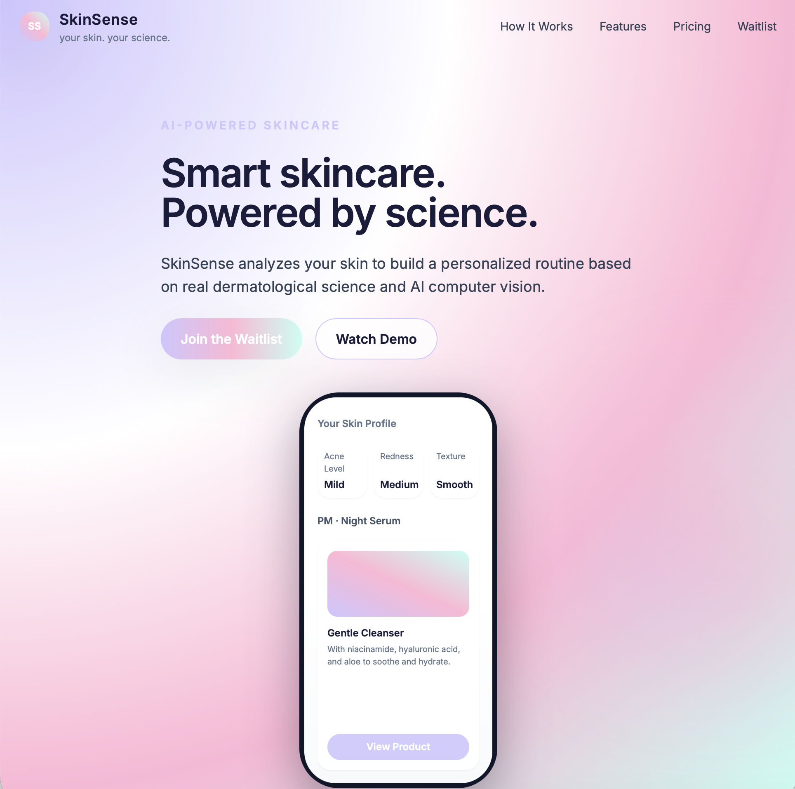
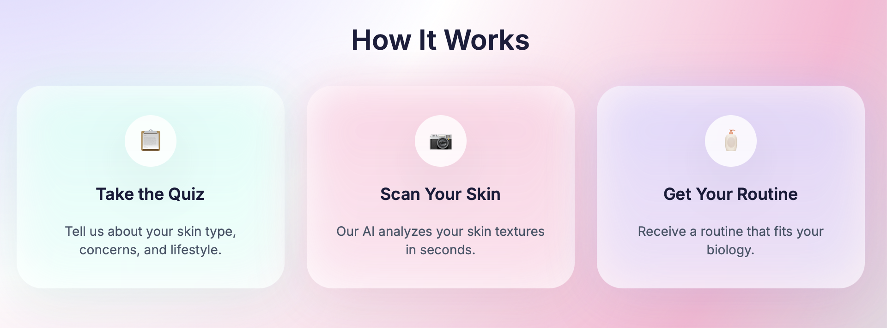
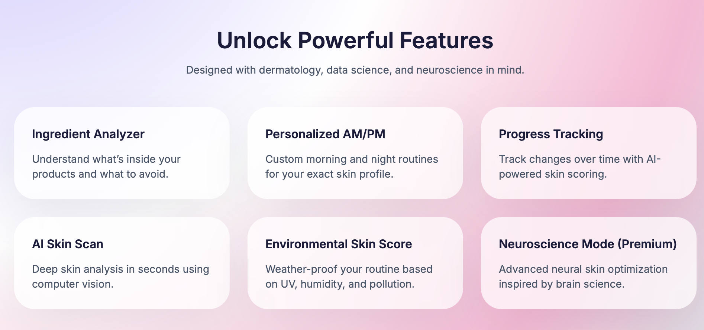
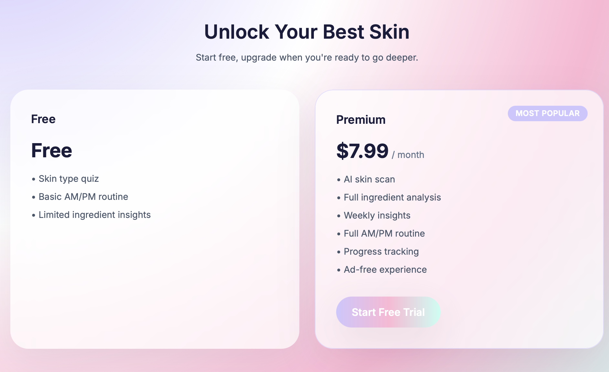
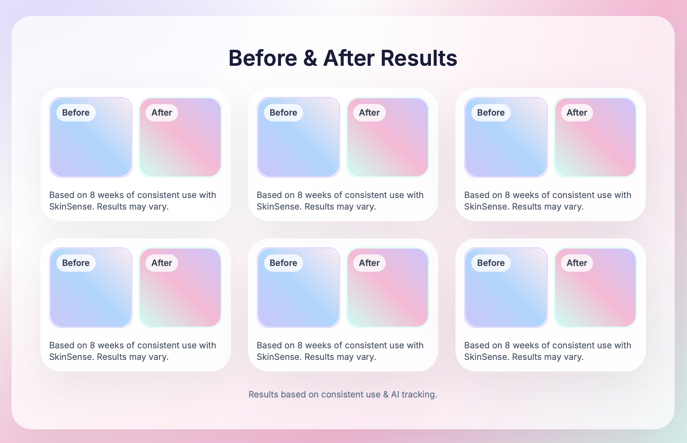
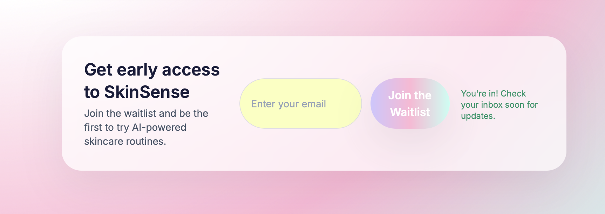

<div align="center">
  
</div>
# SkinSense — Your Skin. Your Science.

AI-powered skincare routine generator.  
Personalized routines, ingredient analysis, and real-time skin insights using computer vision and machine learning.

Live Demo: https://skinsense-landing.vercel.app

## Screenshots

### Hero Section


### How It Works


### Features Section


### Pricing / Freemium Section


### Before and After Results


### Waitlist Section


---

## Overview

SkinSense is an AI-powered skincare recommendation engine that analyzes your skin, builds personalized AM/PM routines, evaluates ingredients, and tracks progress over time.

This repository contains the SkinSense Landing Page, designed to collect waitlist signups and showcase the product vision.

The live site is deployed on Vercel, using a Next.js backend API route to store waitlist entries in Firebase Firestore.

---

## Features

### AI-Powered Skincare Engine (coming soon)
- Skin analysis using computer vision  
- Ingredient breakdowns and comedogenic profiling  
- Personalized AM/PM routines  
- Environmental skin score (UV, humidity, pollution)  
- Skin tracking and progress visualization  

### Landing Page Features (this repo)
- Fully responsive pastel-themed UI  
- Hero section with app previews  
- “How It Works” flow  
- Features grid  
- Pricing tiers (Free, Pro, Premium)  
- Before/After results gallery  
- Launch video section  
- Functional waitlist system connected to Firebase Firestore  
- Vercel + Next.js App Router  
- TailwindCSS design system  

---

## Tech Stack

### Frontend
- Next.js (App Router)
- React
- TailwindCSS

### Backend
- Next.js API Routes (server-side)
- Firebase Firestore

### Deployment
- Vercel

---

## Setup and Installation

### 1. Clone the repository

```bash
git clone https://github.com/galaxygab121/skinsense-landing.git
cd skinsense-landing
2. Install dependencies
npm install
3. Add Firebase environment variables
Create a file named .env.local in the project root:
NEXT_PUBLIC_FIREBASE_API_KEY=yourKey
NEXT_PUBLIC_FIREBASE_AUTH_DOMAIN=yourDomain
NEXT_PUBLIC_FIREBASE_PROJECT_ID=yourProjectId
NEXT_PUBLIC_FIREBASE_STORAGE_BUCKET=yourBucket
NEXT_PUBLIC_FIREBASE_MESSAGING_SENDER_ID=yourSenderId
NEXT_PUBLIC_FIREBASE_APP_ID=yourAppId
4. Start development server
npm run dev
5. Open in browser
Visit:
http://localhost:3000
Firebase Waitlist Integration
Each waitlist entry saved in Firestore includes:
{
  "email": "example@gmail.com",
  "createdAt": "<server timestamp>",
  "source": "landing-page"
}
API Route Used
Location: app/api/waitlist/route.ts
This server-side route:

Accepts POST requests from the waitlist form
Validates that the provided email is correctly formatted
Initializes Firebase using the environment variables
Inserts the email into Firestore under the waitlist collection
Returns a JSON success or error response
Runs only on the server (never exposed to the browser)
This ensures privacy, security, and proper database handling for user signups.
